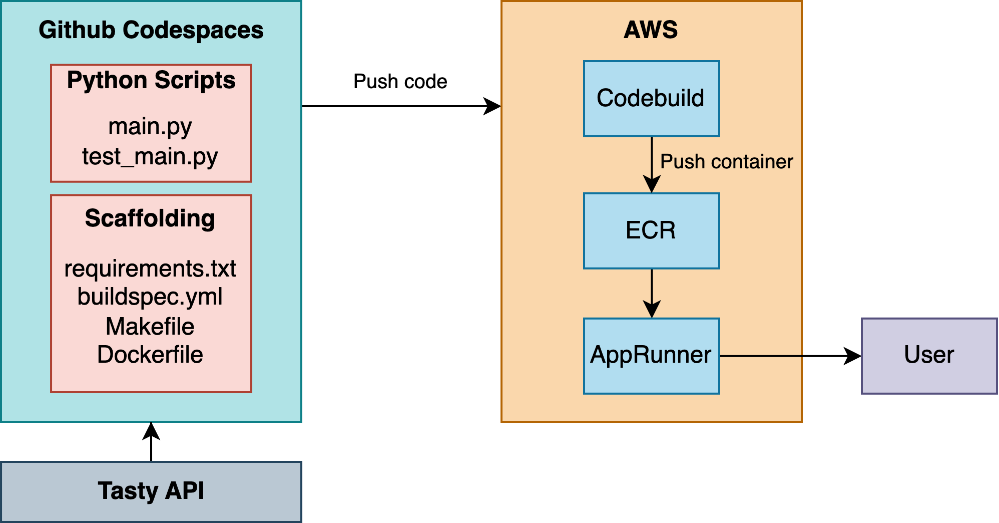

# Continuous Delivery of FastAPI Data Engineering API on AWS

## Key Objectives

I built a microservice that suggests a recipe idea when a user queries a food or ingredient. The data comes from [Tasty API](https://rapidapi.com/apidojo/api/tasty/). The output will is a dictionary containing recipe ideas with the food name. I enabled continuous delivery using AWS App Runner and CodeBuild.

## Workflow Diagram

## Workflow Steps 

### 1. Create Python script leveraging [Tasty API](https://rapidapi.com/apidojo/api/tasty/) and FastAPI.
* Store data as a JSON object.
* Display web API using FastAPI. 
* `uvicorn main:app --host 0.0.0.0 --port 8888` to view FastAPI locally 

### 2. Containerize FastAPI and push to AWS ECR 
* To containerize FastAPI, build image and tag locally with `docker build .` 
* Copy Github repo in AWS Cloud9 environment.
* Create image in ECR.
* In Cloud9 terminal, use commands from 'View push commands' in ECR to push FastAPI to ECR. 
### 3. Deploy containerized API using AWS App Runner.
* Create new IAM role for AWS service and CodeBuild (search for admin and select "provides full access to AWS services and resources"). 
* Create service in App Runner and choose image for source.

### 4. Perform continuous delivery using AWS CodeBuild.
* Create build project and choose Github project for source. 

## Example 
### Input: 
/recipe/avocado

### Output: 
`{'results': [{'display': 'avocado', 'search_value': 'avocado', 'type': 'ingredient'}, {'search_value': 'avocado toast', 'type': 'ingredient', 'display': 'avocado toast'}]}`
